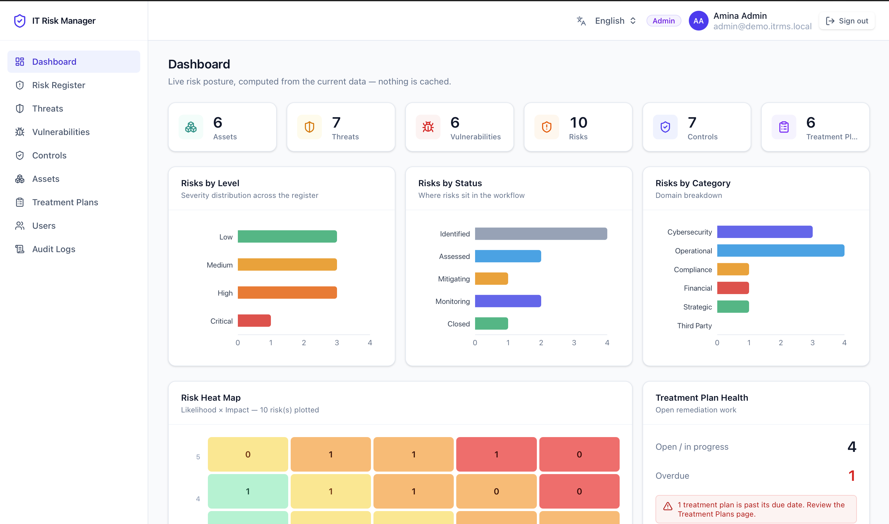
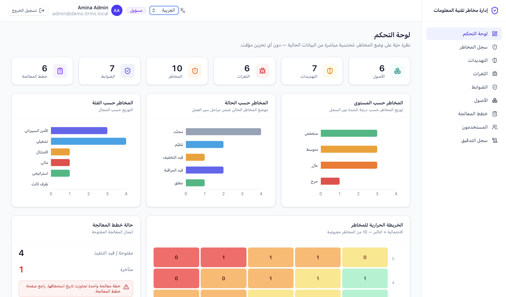
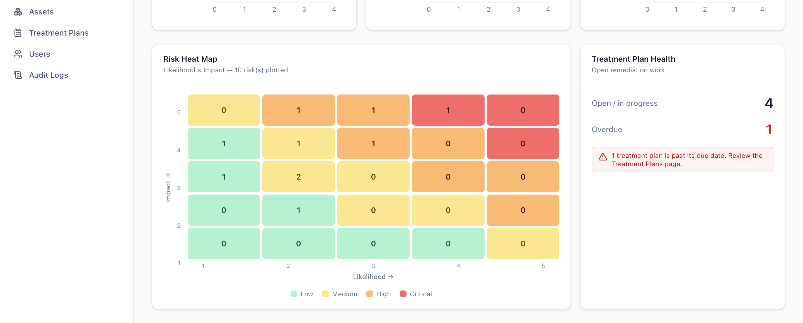
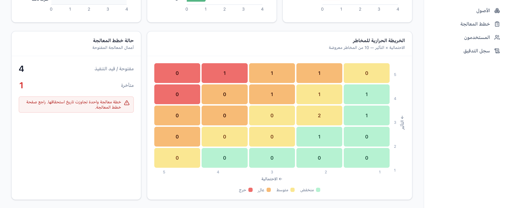
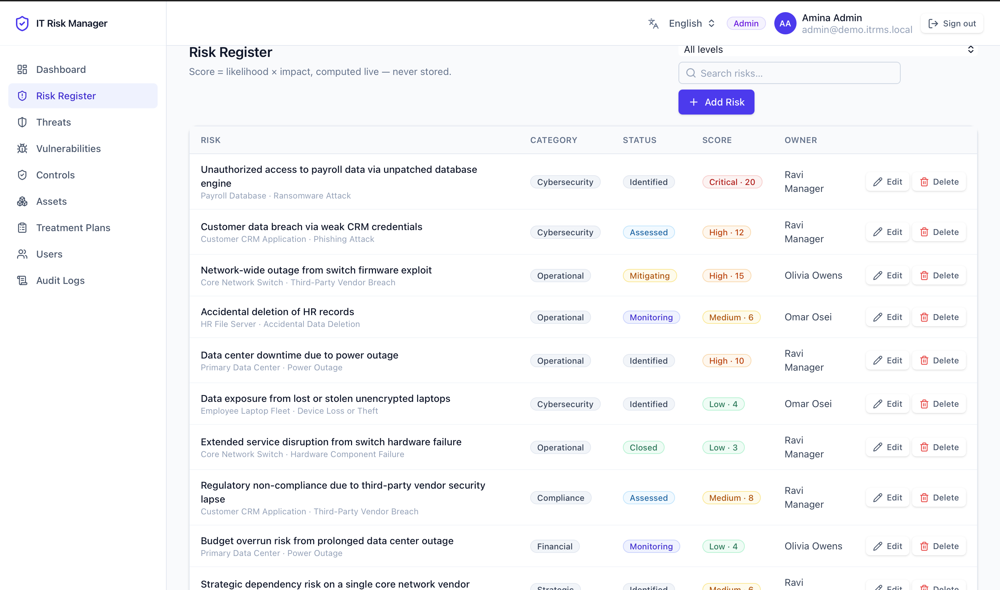
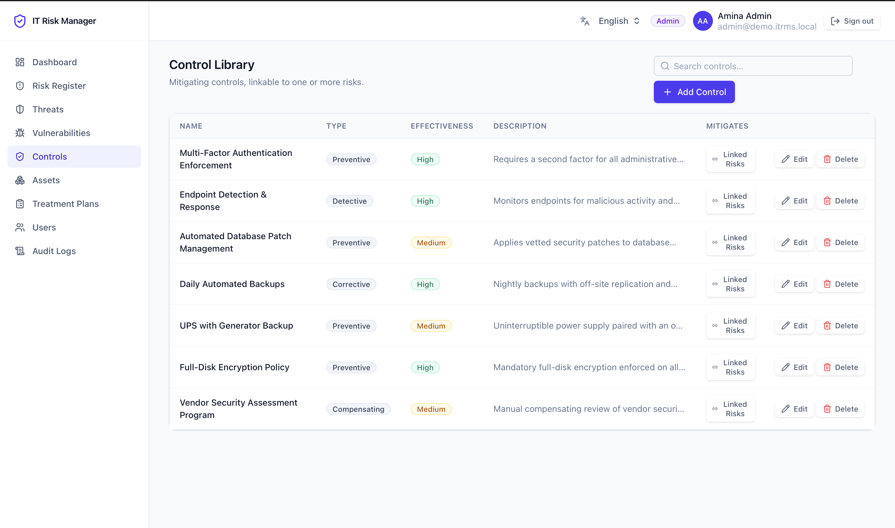
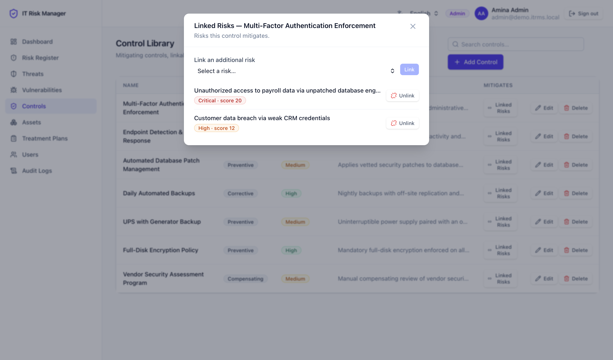
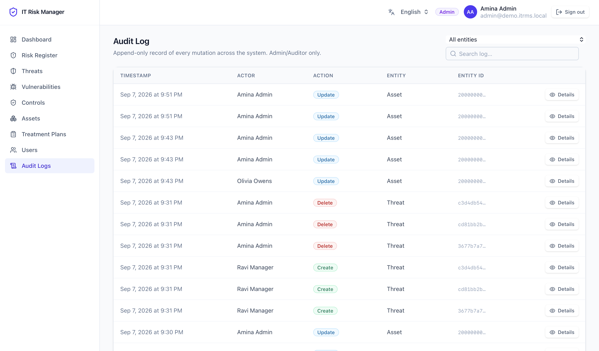
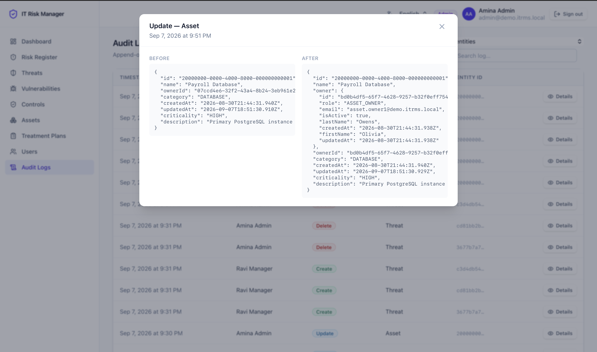

# IT Risk Management System

Portfolio project — a full-stack IT risk management (GRC) platform for identifying, assessing,
and treating IT risks, with a bilingual (English/Arabic) React frontend and a NestJS + PostgreSQL
backend.

**Stack:** React + TypeScript + Vite (i18n, RTL/LTR) · NestJS + TypeScript (JWT auth, RBAC) ·
PostgreSQL + Prisma

**Status:** Fully functional end to end — backend API, database, and frontend UI are all
implemented and wired together. Auth & five-role RBAC, the full risk-management catalog (assets,
threats, vulnerabilities, risks, controls with risk linking, treatment plans), an audit log, and a
dashboard with a 5×5 risk heat map are all reachable through both the API directly and the web UI,
in English or Arabic with full RTL layout support.

## Features

- **Authentication** — cookie-based login (`POST /auth/login`), an httpOnly JWT session cookie,
  logout, and a `GET /auth/me` session check. No tokens are ever exposed to client-side JavaScript.
- **Five-role RBAC** — `ADMIN`, `RISK_MANAGER`, `ASSET_OWNER`, `AUDITOR`, `VIEWER`, enforced at the
  API layer (not just hidden in the UI) — see [Roles](#roles) below.
- **Risk Register** — create, assess, and track risks (category, status, likelihood × impact),
  linked to an asset, a threat, an optional vulnerability, and an accountable owner.
- **Assets** — an IT asset inventory, each with an accountable owner.
- **Threats** — a reusable threat catalog referenced by risks.
- **Vulnerabilities** — weaknesses tied to a specific asset.
- **Controls** — a control library, each linkable to one or more mitigated risks (**Linked Risks**).
- **Treatment Plans** — remediation work tracked against a risk, with a due date, status, and owner.
- **Audit Logs** — an append-only record of every mutation across the system (who, what, before/after).
- **Dashboard** — live totals, risks by level/status/category, and treatment-plan open/overdue counts.
- **Risk Heat Map** — the full 5×5 likelihood × impact matrix with real risk counts per cell.
- **English/Arabic bilingual interface** — a language switcher in the app header, with all UI text
  centrally translated (no strings scattered through components).
- **RTL/LTR support** — switching to Arabic sets `dir="rtl"` on the document and the whole layout
  (navigation, tables, forms, modals, charts) mirrors correctly using logical CSS properties, not
  manually reversed text.

## Architecture / Tech stack

| Layer | Technology |
|---|---|
| Frontend | React 19 + TypeScript + Vite, TanStack Query for server state, React Router, a custom i18n context (English/Arabic, RTL/LTR) |
| Backend framework | NestJS 11 (TypeScript) |
| ORM / database | Prisma 6 + PostgreSQL 16 |
| Auth | Passport (local + JWT strategies), JWT stored in an httpOnly cookie |
| Validation | class-validator / class-transformer, via a global `ValidationPipe` |
| Security | Helmet security headers, global rate limiting, RBAC guards, startup validation of `JWT_SECRET` |
| Shared logic | `packages/shared` — risk-scoring logic (score/level), shared by frontend and backend |
| Testing | Jest (unit tests) + Supertest (e2e scaffold) |

See [`docs/architecture.md`](docs/architecture.md) for the full technical breakdown, and
[`docs/security.md`](docs/security.md) for the security design and known limitations.

## Prerequisites

- Node.js **22+** (see `.nvmrc`)
- Docker (for the provided `docker-compose.yml` PostgreSQL instance) — or any PostgreSQL 16
  instance you already have reachable

## Project structure

```
apps/
  api/       NestJS + TypeScript backend — auth, RBAC, all domain modules, Prisma
  web/       React + TypeScript + Vite frontend — pages, i18n (EN/AR + RTL), API client
packages/
  shared/    Framework-agnostic TypeScript shared between apps (risk-scoring logic)
docs/        Architecture, API reference, ERD, setup guide, environment variables, security notes
```

## Getting started

```bash
# 1. Install dependencies (all three workspaces, from the repo root)
npm install

# 2. Start PostgreSQL (or point at an existing Postgres 16 instance — see step 3)
docker compose up -d

# 3. Configure environment variables
cp .env.example .env
cp apps/api/.env.example apps/api/.env
cp apps/web/.env.example apps/web/.env
# Adjust apps/api/.env if needed — see docs/environment-variables.md.
# JWT_SECRET must be a long random value; the API refuses to start with the
# example placeholder or anything shorter than 16 characters (see docs/security.md).

# 4. Build the shared package (apps/api imports it at runtime)
npm run build -w packages/shared

# 5. Apply migrations and seed demo data
cd apps/api
npx prisma migrate deploy   # or `npx prisma migrate dev` on a fresh dev database
npm run prisma:seed
cd ../..

# 6. Start the API (from the repo root)
npm run dev:api

# 7. In a second terminal, start the frontend
npm run dev:web
```

The API listens on `http://localhost:3000` by default. **Open the frontend at
`http://localhost:5173`** and log in with one of the demo accounts below.

See [`docs/setup-guide.md`](docs/setup-guide.md) for the full walkthrough, every dev command, and
troubleshooting.

## Demo login

The seed script (`apps/api/prisma/seed.ts`) is idempotent — safe to re-run. It creates one demo
user per role, all sharing the same password:

| Email | Role | Password |
|---|---|---|
| admin@demo.itrms.local | ADMIN | `Demo#Passw0rd!` |
| risk.manager@demo.itrms.local | RISK_MANAGER | `Demo#Passw0rd!` |
| asset.owner1@demo.itrms.local | ASSET_OWNER | `Demo#Passw0rd!` |
| asset.owner2@demo.itrms.local | ASSET_OWNER | `Demo#Passw0rd!` |
| auditor@demo.itrms.local | AUDITOR | `Demo#Passw0rd!` |
| viewer@demo.itrms.local | VIEWER | `Demo#Passw0rd!` |

> **These are development/demo credentials only.** They are intentionally shared across every
> seeded account, documented in this public README, and used purely to make the demo data usable
> out of the box. Never reuse this password, or the `changeme` placeholders in `.env.example`, for
> any account or secret outside local development — see [`docs/security.md`](docs/security.md).

Along with those users, the seed also creates 6 assets, 7 threats, 6 vulnerabilities, 10
interconnected risks (spanning every risk level, status, and category), 7 controls, 10
risk↔control links, and 6 treatment plans — enough to populate the dashboard and heat map with
realistic, non-trivial data.

## Roles

| Role | Intended access |
|---|---|
| `ADMIN` | Full access, including user management (`/users`) and audit logs. The only role that can create, update, or deactivate other accounts. |
| `RISK_MANAGER` | Manages the full risk-management catalog — assets, threats, vulnerabilities, risks, controls, treatment plans — but cannot manage users or view audit logs. |
| `ASSET_OWNER` | Can update the assets they personally own (but not reassign ownership, and not create/delete assets); read access everywhere else. |
| `AUDITOR` | Read-only across the system, with exclusive (alongside `ADMIN`) access to the audit log. |
| `VIEWER` | Read-only across the system; no audit log access. |

Every one of these boundaries is enforced server-side (NestJS guards and, where a role alone isn't
precise enough — like asset ownership — service-level checks), not just hidden in the UI. See
[`docs/security.md`](docs/security.md) for the full authorization design.

## Documentation

| Doc | Covers |
|---|---|
| [`docs/architecture.md`](docs/architecture.md) | Monorepo layout, stack, backend layering, request pipeline, frontend data flow, i18n/RTL approach |
| [`docs/erd.md`](docs/erd.md) | Entity-relationship diagram and schema notes |
| [`docs/api-reference.md`](docs/api-reference.md) | Every endpoint, its roles, and its behavior |
| [`docs/setup-guide.md`](docs/setup-guide.md) | Full local setup, everyday dev commands, troubleshooting |
| [`docs/environment-variables.md`](docs/environment-variables.md) | Every `.env` variable across all three apps |
| [`docs/security.md`](docs/security.md) | Auth/RBAC design, security controls, and known limitations |

## Screenshots

<table>
<tr>
<td></td>
<td></td>
</tr>
<tr>
<td align="center"><sub>Dashboard — English (LTR)</sub></td>
<td align="center"><sub>Dashboard — Arabic (RTL) — the entire layout mirrors, not just the text</sub></td>
</tr>
<tr>
<td></td>
<td></td>
</tr>
<tr>
<td align="center"><sub>Risk heat map & treatment plan health</sub></td>
<td align="center"><sub>Same view in Arabic — heat map and axes mirror too</sub></td>
</tr>
<tr>
<td></td>
<td></td>
</tr>
<tr>
<td align="center"><sub>Risk Register</sub></td>
<td align="center"><sub>Control Library</sub></td>
</tr>
<tr>
<td></td>
<td></td>
</tr>
<tr>
<td align="center"><sub>Linking a control to the risks it mitigates</sub></td>
<td align="center"><sub>Audit Log — append-only mutation history</sub></td>
</tr>
<tr>
<td></td>
<td></td>
</tr>
<tr>
<td align="center"><sub>Audit entry detail — full before/after field diff</sub></td>
<td></td>
</tr>
</table>

## License

This repository does not currently declare an open-source license — `apps/api/package.json` is
marked `"license": "UNLICENSED"`, and no root `LICENSE` file exists. Add one (e.g. MIT) before
treating this as reusable open-source code.
