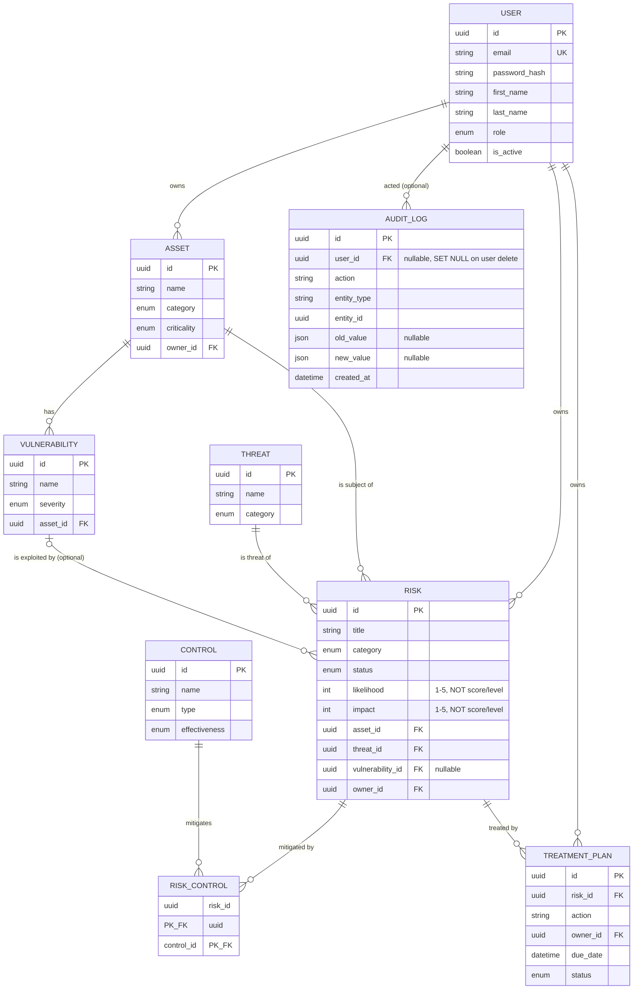

# Entity-Relationship Diagram

Source of truth: [`apps/api/prisma/schema.prisma`](../apps/api/prisma/schema.prisma). Nine tables,
no more — the MVP scope deliberately excludes compliance-framework, attachment, and notification
tables.

## Notes

- **`risk.likelihood` / `risk.impact` are the only persisted risk-scoring inputs.** There is no
  `score` or `level` column anywhere in the schema — both are always derived at read time via
  `packages/shared`. See [`architecture.md`](./architecture.md).
- **`risk_control`** is a pure many-to-many join table with a composite primary key
  (`risk_id`, `control_id`) and no surrogate `id` — a risk can have many mitigating controls, and a
  control can mitigate many risks.
- **`risk.vulnerability_id` is optional** (`ON DELETE SET NULL`) — a risk can exist without a
  specific known vulnerability (e.g. a strategic or compliance risk).
- **`audit_log.user_id` is optional** (`ON DELETE SET NULL`) — deleting a user preserves the
  historical audit trail of their actions instead of cascading the delete into it.
- Every other foreign key (`asset.owner_id`, `vulnerability.asset_id`, `risk.asset_id`,
  `risk.threat_id`, `risk.owner_id`, `treatment_plan.risk_id`, `treatment_plan.owner_id`) is
  `ON DELETE RESTRICT` or `CASCADE` as appropriate — e.g. deleting an `Asset` that still has
  `Vulnerability` or `Risk` rows pointing at it is rejected (`409 Conflict`) rather than silently
  cascading, and deleting a `Risk` cascades to its `risk_control` links and `treatment_plan` rows.
